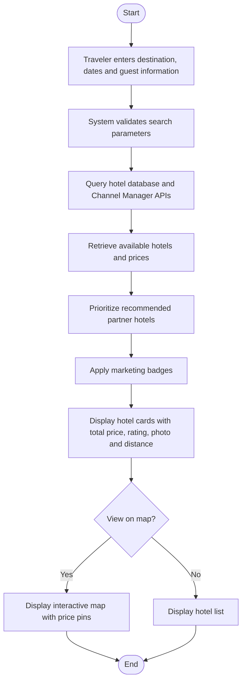

# Feature: Hotel Search & Filtering Module

## Use Case: Search Hotels

This activity diagram illustrates the hotel search process in the TravelMate platform. The main participants are the traveler and the TravelMate system. The workflow shows how the user enters search criteria, the system retrieves and processes hotel data, and the search results are displayed.

